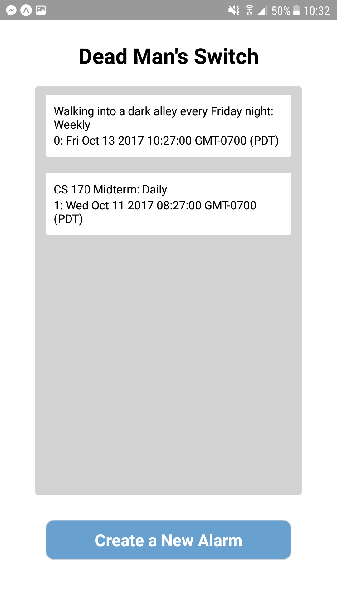
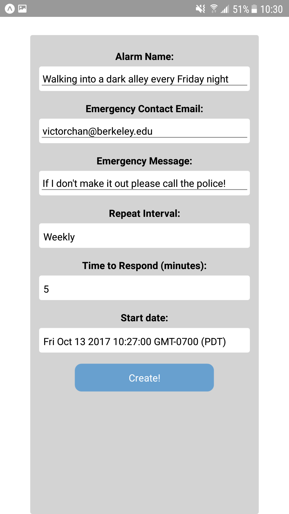
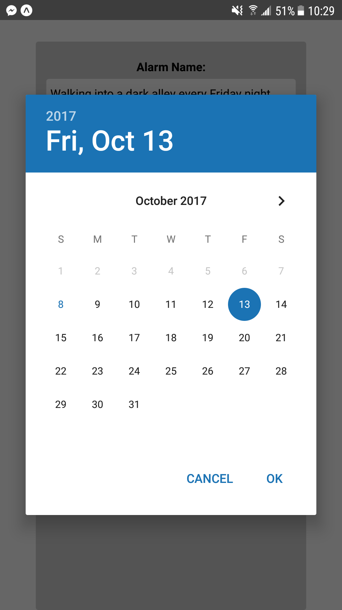

# DMS

Welcome to DMS, a safety and accountability mobile application. DMS is a dead man switch that allows you to set regular alarms and receive notifications whenever an alarm is visited. The user must dismiss the notification, or else DMS will notify emergency contacts with a message and alert them to possible problems.

## Contributors

| Team Member | Github |
| ----------- | ------ |
| Victor Chan | [victorchan314](http://github.com/victorchan314) |
| Andrew Dickson | [amdson](http://github.com/amdson) |
| Christian Lee | [chrisjaesun](http://github.com/chrisjaesun) |
| Henk Tillman | [henktillman](http://github.com/henktillman) |

## Inspiration

The inspiration for the application derived from our team members' travels. We all had experienced sketchy, and sometimes even outright dangerous situations in the past when we were out of state or country. In situations like thos, we needed a safeguard to ensure that we would have friends and family watching out for us and receiving regular updates so that they wouldn't have to worry about our safety. And thus, DMS was born.

## Features

- Alarms set in regular hourly, daily, or weekly intervals
- Custom alarm start times with minute-precision
- Storage for up to 1000 emergency contact emails
- Customizable emergency message for contacts
- Unlimited number of alarms for travel, work, or school
- Compatible with both iOS and Android

## Implementation Details

### Front-end

The mobile app is implemented in React Native with the [Expo API](https://expo.io/). This allows us to be cross-compatible with a simple but sleek interface designed for quick and easy usage.

<!--

-->

### Back-end

- Server: Our [server](https://github.com/victorchan314/dmsserver) runs on Node.JS. We listen for POST requests from the mobile app and send the data to our external JS file to process. A second server listens for POST requests from the local machine, which indicates that an alarm has been set off and a push notification needs to be sent to the mobile device.
- Alarm Class: Alarm is a JavaScript class that stores each alarm the user creates. Each instance stores an alarm hash, name, emergency contats, emergency message, interval length, and start date, as well as a number of flags used to handle triggering of alarms and emails.
- AlarmHandler Object: AlarmHandler deals with the overarching process of keeping track of alarms and setting them off. It stores each of the individual alarms in a HashMap. In addition, it stores 3 arrays, one corresponding to each selectable interval (hourly, daily, weekly), each element of which contains a HashMap of alarms slated to go off at that time. Every minute, the AlarmHandler triggers all alarms set to go off at that time and begins watching for responses.
- Emails: We used the [SparkPost API](https://www.sparkpost.com/) to handle the emails to emergency contacts. If the triggered alarms are not dismissed within the interval, the Alarm object sends the emergency message to all emergency contacts, notifying them that something is wrong.

## Usage

1. The user creates an alarm with the mobile app
2. The server stores the alarm
3. Once the alarm is triggered, the object sends a POST request to the server indicating that the alarm is active
4. The server sends a push notification to the mobile app indicating an active alarm
5. If the user dimisses the notification, the server is notified through a POST request, and it deactivates the alarm
6. Otherwise, the alarm object expires and the SparkPost API is used to notify emergency contacts with the emergency message
